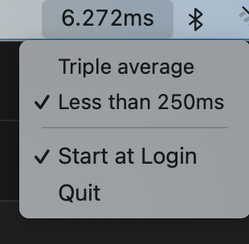

# AmIAlive

A very simple status bar app for MacOS to check if we have a good Internet connection.

It pings to a DNS server (that can be configured) and outputs the current round trip time.

You can then choose to be alerted on of two conditions.

+ The most recent ping exceeds a certain threshold (by default 250ms).
+ The most recent ping exceeds a certain multiple of the moving average of the last 10 pings.

It only works on Mac. And I have only tested on a Mac x86. It works for me!!!

You can download the most recent release, but MacOS might complain about some file coming from the Internet.

You can also build the code yourself. Just download the repo and do

`go build .`

It even has some basic tests (thanks ChatGPT).

Thanks to https://github.com/caseymrm/menuet for providing the framework that helped build an app so easily.

Feel free to fork
