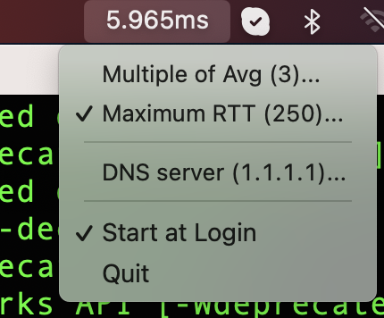

# AmIAlive

A very simple status bar app for MacOS to check if we have Internet.

It pings to a DNS server (it can be changed in the code) and outputs the current round trip time.

It also keeps an internal record of the last 10 times (it can be changed) and if the RTT is bigger than triple the average (or if we have packet loss) it beeps.

It only works on Mac. And I have only tested on a Mac x86 (amd64) but we also release an arm64 (Apple M1, M2, M3)

To build it yourself, download the code and do

`go build .`

Thanks to https://github.com/caseymrm/menuet
